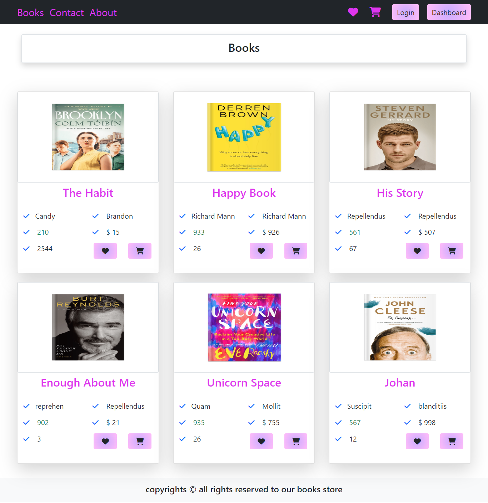
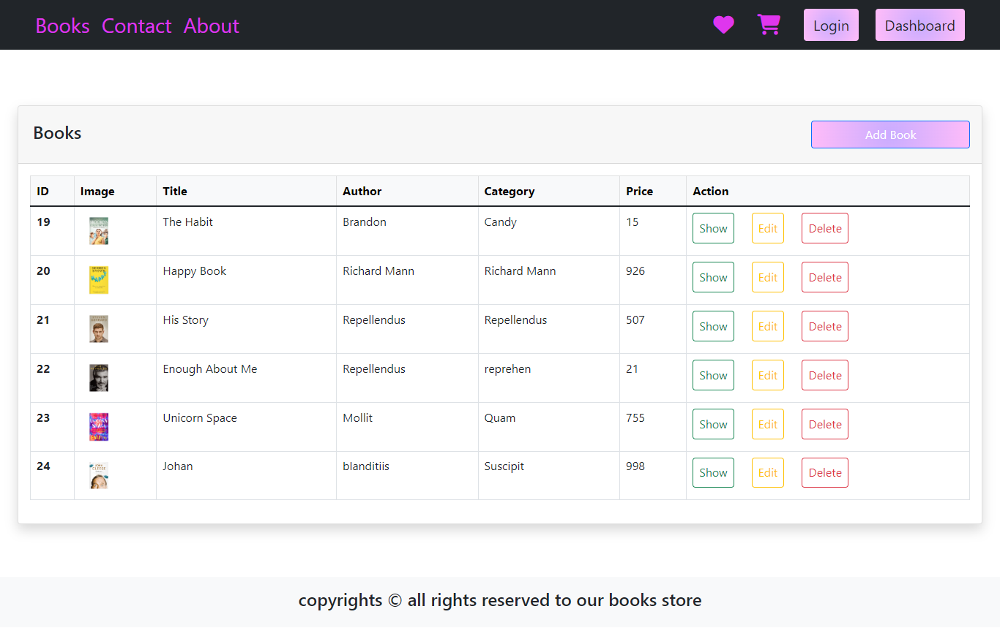
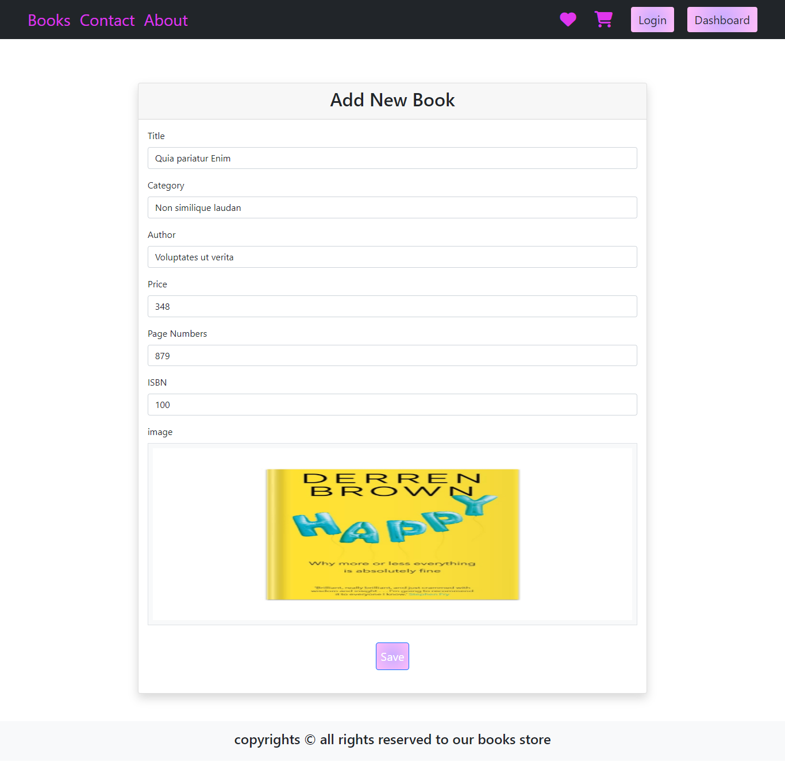
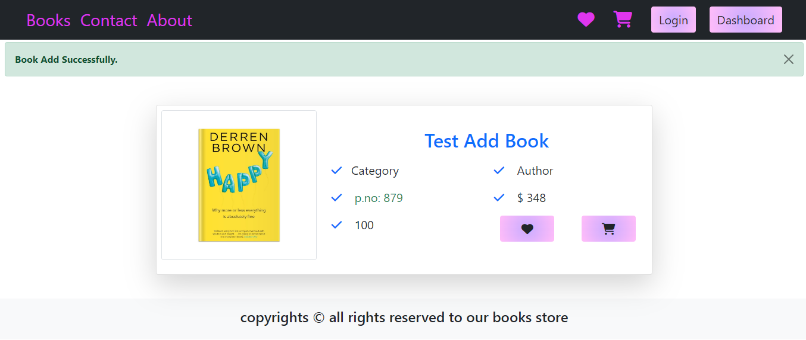
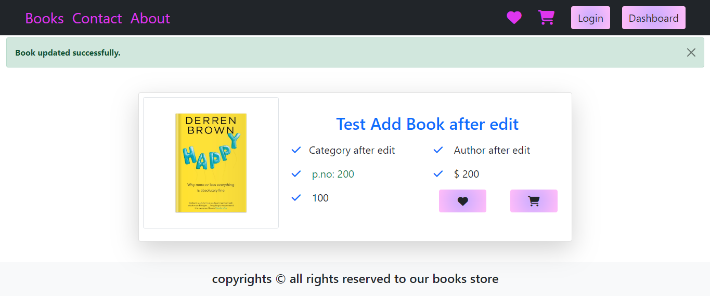
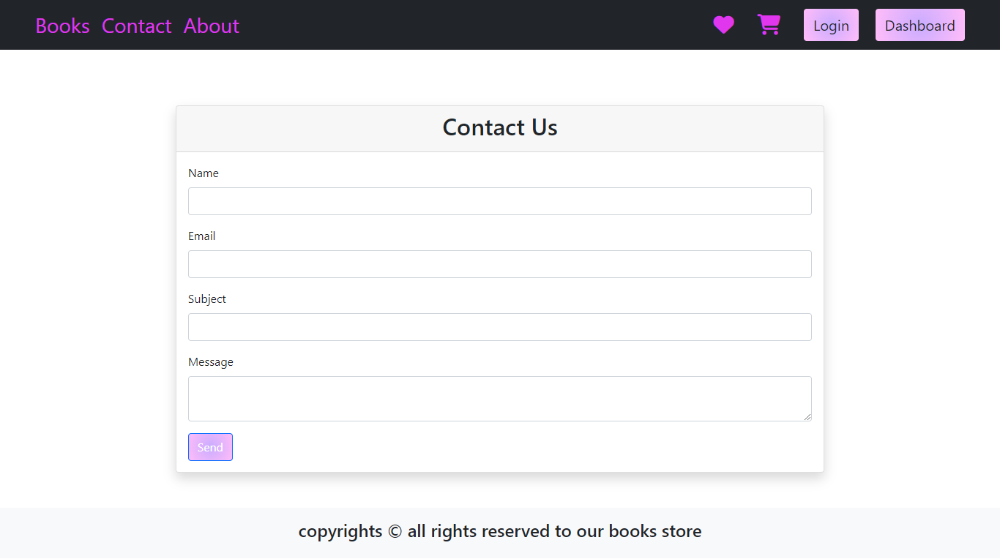
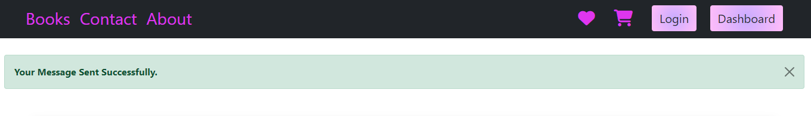
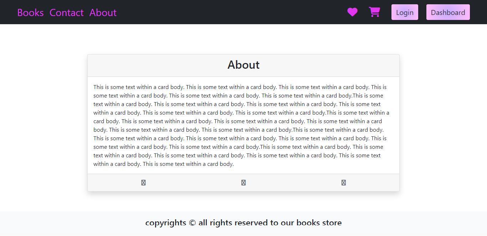

# Books Store

. You will build part of small Nursery, the system will have only one administrator with static username and password, teachers and children. Teachers should register first, and administrator will add children to the system. Back end will be created as RESTFUL API with json responses with correct status code

## Features
- Crud of Books
- Contact Us Page
- About Us
- upload images

## Installation
 - venv\Scripts\activate

## Usage

- python manage.py runserver
- then run project on http://127.0.0.1:8000/books/
- and can show dashboard on http://127.0.0.1:8000/books/index

## Images

